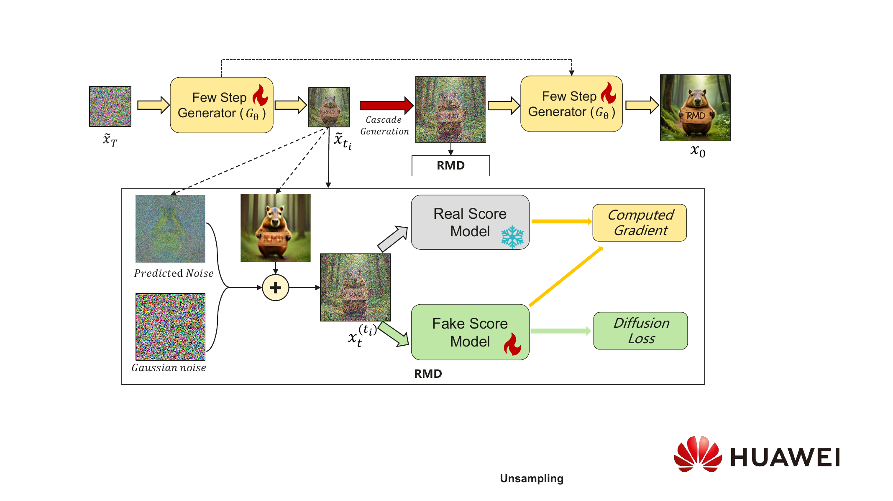
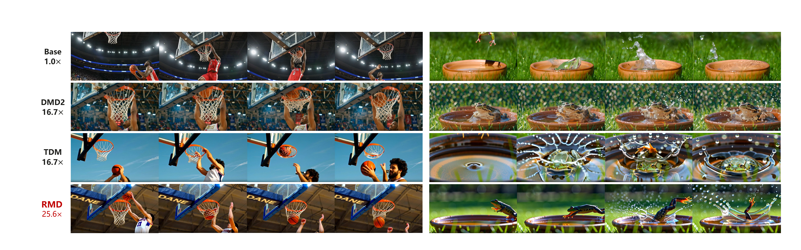

# RMD：跨分辨率分布匹配蒸馏

[English](README.md)

[[论文](https://arxiv.org/abs/2603.06136)]


[](https://github.com/Skylar-aigc/RMD-Inference-Acceleration/actions/workflows/ci.yml)

**Cross-Resolution Distribution Matching for Diffusion Distillation** 的官方实现。RMD 将预训练扩散模型蒸馏为少步生成器：前期在低分辨率下构建整体结构，后期切换到高分辨率细化纹理，从而降低视频生成开销。



## 主要特点

- 少步 480p→720p 级联视频生成。
- 沿跨分辨率轨迹进行分布匹配蒸馏。
- 使用预测噪声重注入稳定分辨率切换。
- 支持 CUDA/NPU、FSDP 多卡训练、分布式推理和 VBench 格式生成。

## 论文结果

下表为论文中的 Wan2.1-T2V-14B 结果，速度在单张 NVIDIA A100 上测量。

| 方法 | NFE | 加速比 | VBench 总分 | 质量 | 语义 | T2V-CompBench |
|---|---:|---:|---:|---:|---:|---:|
| Wan2.1 720p | 50 × 2 | 1.0× | 83.75 | 85.44 | 76.95 | 54.17 |
| DMD2 | 6 | 16.7× | 80.30 | 81.98 | 73.60 | 52.81 |
| TDM | 6 | 16.7× | 80.48 | 81.85 | 75.00 | 52.27 |
| **RMD** | **3 + 3** | **25.6×** | **82.51** | **84.37** | **75.05** | **54.00** |



## 环境安装

推荐使用 Linux、Python 3.10/3.11 和 CUDA 版 PyTorch。先根据服务器驱动安装匹配的 PyTorch，再安装本项目：

```bash
git clone <repository-url> RMD
cd RMD

python3 -m venv .venv
source .venv/bin/activate
pip install --upgrade pip

# 仅为示例，请按服务器 CUDA 版本选择 PyTorch。
pip install torch torchvision --index-url https://download.pytorch.org/whl/cu121
pip install -e .
```

可选依赖：

```bash
pip install -e ".[gradio]"   # Web 演示
pip install -e ".[dev]"      # 测试和代码检查
pip install -e ".[npu]"      # 昇腾 NPU
```

检查环境：

```bash
python -c "import torch; print(torch.__version__, torch.cuda.device_count())"
rmd-train --help
rmd-infer --help
```

## 模型和数据

RMD 使用 Diffusers 格式的 Wan 模型，可以填写 Hugging Face 模型 ID，也可以使用本地目录：

本代码仓库不直接存放蒸馏后的学生模型权重。请使用下方配方训练，或通过 `--model_dir` 指向兼容的 `student_model-<step>` 导出目录。

```text
/data/models/Wan2.1-T2V-1.3B-Diffusers/
├── model_index.json
├── tokenizer/
├── text_encoder/
├── transformer/
├── scheduler/
└── vae/
```

在训练 YAML 中设置 `pretrained_model_name_or_path`，也可以通过命令行覆盖。默认配方对应：

- `Wan-AI/Wan2.1-T2V-1.3B-Diffusers`
- `Wan-AI/Wan2.1-T2V-14B-Diffusers`

训练数据为 UTF-8 文本文件，每行一条 prompt。项目内置 `examples/vidprom_prompts_2000.txt`，包含可复现抽样的 2,000 条 VidProM 纯文本 prompt，遵循上游 CC BY-NC 4.0 许可。论文实验使用 JourneyDB prompt；内置数据仅用于方便启动，并非论文训练集。详见[数据说明](examples/VIDPROM_DATASET.md)。

## 模型训练

默认配方训练 300 个 optimizer step，并在第 50、100、150、200、250、300 step 保存模型。

### 单进程训练

```bash
rmd-train \
  --config configs/train_wan_1_3b.yaml \
  --pretrained_model_name_or_path /data/models/Wan2.1-T2V-1.3B-Diffusers \
  --data_path examples/vidprom_prompts_2000.txt \
  --output_dir /data/runs/rmd-1.3b
```

### 8 卡 FSDP 训练

```bash
bash scripts/train_8gpu.sh configs/train_wan_1_3b.yaml \
  --pretrained_model_name_or_path /data/models/Wan2.1-T2V-1.3B-Diffusers \
  --output_dir /data/runs/rmd-1.3b-8gpu
```

训练 Wan2.1-14B 时，将配置替换为 `configs/train_wan_14b.yaml`。14B 对 GPU 显存和主机内存的要求明显更高。

从最新断点恢复：

```bash
bash scripts/train_8gpu.sh configs/train_wan_14b.yaml \
  --output_dir /data/runs/rmd-14b \
  --resume_from_checkpoint latest
```

设置 `validation_prompt_path` 后，会在第 1 step 以及每次保存 checkpoint 时生成 10 个测试视频，输出到 `test_samples/step-<N>/`。

### 关键参数

| 参数 | 含义 |
|---|---|
| `k_step` | 学生模型的去噪步数。 |
| `low_rs_step` | 前期低分辨率去噪步数。 |
| `flow_shift_trans: 0` | 不切换分辨率。 |
| `flow_shift_trans: 1` | 采样过程中从 480p 上采样到 720p。 |
| `flow_shift_trans: 2` | 上采样，同时将 flow shift 从 3 切换为 5。 |
| `eta` | 预测噪声混合系数；训练与推理应使用相同值。 |
| `checkpointing_steps` | 模型保存间隔；提供的配方默认为 50。 |

## 模型推理

推理时应使用与训练一致的基础模型和采样参数：

```bash
rmd-infer \
  --model_dir /data/runs/rmd-1.3b/student_model-300 \
  --pretrained_model_name_or_path /data/models/Wan2.1-T2V-1.3B-Diffusers \
  --prompt "A red fox running through a snowy forest" \
  --resolution 720 \
  --k_step 6 \
  --flow_shift_trans 1 \
  --low_rs_step 3 \
  --eta 0.9 \
  --output_dir outputs/demo
```

批量读取 prompt 文件：

```bash
rmd-infer \
  --model_dir /data/runs/rmd-1.3b/student_model-300 \
  --pretrained_model_name_or_path /data/models/Wan2.1-T2V-1.3B-Diffusers \
  --prompt_file examples/sample_prompts.txt \
  --resolution 720 --k_step 6 --flow_shift_trans 1 --low_rs_step 3 --eta 0.9 \
  --output_dir outputs/batch
```

使用 8 张卡分发 prompt：

```bash
accelerate launch --num_processes 8 -m rmd.cli infer \
  --model_dir /data/runs/rmd-1.3b/student_model-300 \
  --pretrained_model_name_or_path /data/models/Wan2.1-T2V-1.3B-Diffusers \
  --prompt_file examples/sample_prompts.txt \
  --resolution 720 --k_step 6 --flow_shift_trans 1 --low_rs_step 3 --eta 0.9 \
  --output_dir outputs/distributed
```

启动 Web 演示：

```bash
rmd-demo \
  --model_dir /data/runs/rmd-1.3b/student_model-300 \
  --pretrained_model_name_or_path /data/models/Wan2.1-T2V-1.3B-Diffusers \
  --resolution 720 --k_step 6 --flow_shift_trans 1 --low_rs_step 3 --eta 0.9
```

## VBench 评测

按 VBench 文件命名格式生成视频：

```bash
python benchmarks/vbench.py \
  --model_dir /data/runs/rmd-1.3b/student_model-300 \
  --pretrained_model_name_or_path /data/models/Wan2.1-T2V-1.3B-Diffusers \
  --prompt_file /data/VBench/prompts.txt \
  --output_dir outputs/vbench \
  --resolution 720 --k_step 6 --flow_shift_trans 1 --low_rs_step 3 --eta 0.9 \
  --iterations 5
```

生成完成后，使用官方 [VBench](https://github.com/Vchitect/VBench) 工具计算指标。

## 测试

```bash
ruff check src tests benchmarks app.py
pytest -q
```

正式训练前，建议在命令末尾加入 `--max_train_steps 2 --checkpointing_steps 1`，确认所有进程正常启动、loss 为有限值并成功写出 checkpoint。

## 详细文档

- [方法说明](docs/method.md)
- [训练说明](docs/training.md)
- [推理说明](docs/inference.md)
- [昇腾 NPU](docs/npu.md)
- [参与贡献](CONTRIBUTING.md)
- [社区行为准则](CODE_OF_CONDUCT.md)

## 引用

```bibtex
@article{chen2026rmd,
  title={Cross-Resolution Distribution Matching for Diffusion Distillation},
  author={Chen, Feiyang and Pan, Hongpeng and Xu, Haonan and Duan, Xinyu and Wang, Zhefeng and Yang, Yang},
  journal={arXiv preprint arXiv:2603.06136},
  year={2026},
  doi={10.48550/arXiv.2603.06136}
}
```

## 许可证

代码采用 [Apache License 2.0](LICENSE)。Prompt 数据沿用其上游许可证。
